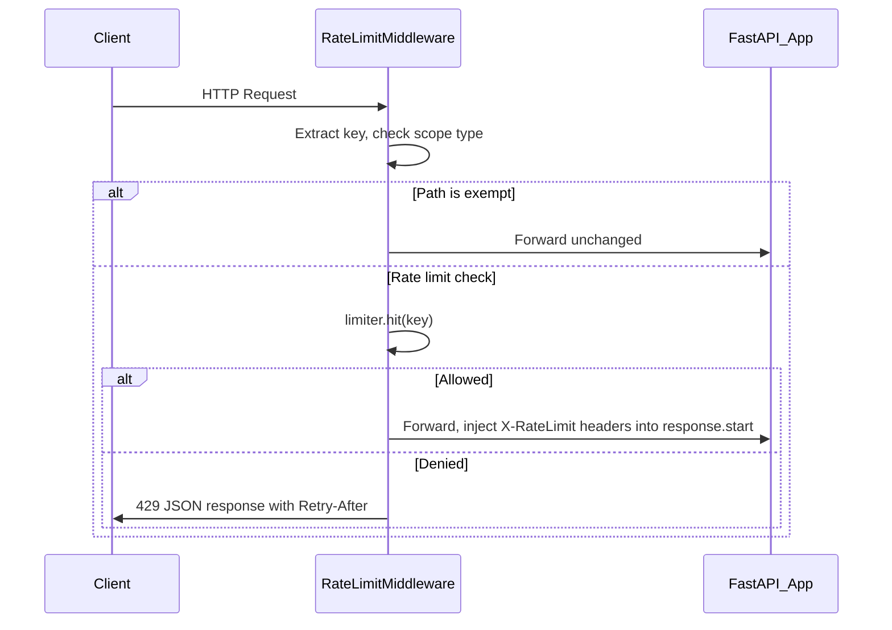

# Fix Rate Limiter Issues

## 1. Fix the dual-limiter bug in [`app/main.py`](app/main.py)

Currently `create_app` creates Limiter #1 (used by middleware) and `lifespan` creates Limiter #2 (used by cleanup). The cleanup thread never cleans the actual limiter, and `/status` reads from the wrong one.

**Fix:** Have `create_app` create the single limiter, store it on `app.state`, and have `lifespan` only manage the cleanup thread lifecycle using the limiter from `app.state`. The `lifespan` will also respect the `settings` passed into `create_app` instead of calling `get_settings()` independently.

## 2. Replace sliding-window-log with sliding-window counter in [`app/rate_limiter/limiter.py`](app/rate_limiter/limiter.py)

Replace the deque-of-timestamps approach with a sliding-window counter that stores only two counters per user:

```python
@dataclass
class _WindowCounter:
    prev_count: int = 0
    prev_start: float = 0.0
    curr_count: int = 0
    curr_start: float = 0.0
    lock: threading.Lock
```

The estimated request count is:

```
weight = (window_size - elapsed_in_current_window) / window_size
count = prev_count * weight + curr_count
```

This gives O(1) memory per user instead of O(N). The public API (`hit`, `peek`, `reset`, `cleanup`) and `RateLimitResult` stay the same so downstream code is unaffected.

## 3. Rewrite middleware as pure ASGI in [`app/rate_limiter/middleware.py`](app/rate_limiter/middleware.py)

Replace `BaseHTTPMiddleware` with a raw ASGI middleware class:



Key changes:

- Implement `__call__(self, scope, receive, send)` instead of `dispatch`
- Intercept `http.response.start` messages to inject rate-limit headers (avoids wrapping the entire response)
- Add `exempt_paths: set[str]` parameter to skip rate limiting for health checks

## 4. Extract shared key-extraction function

Move the duplicated key-extraction logic out of both `middleware.py` and `main.py` into a single shared function in a new utility or directly in [`app/rate_limiter/__init__.py`](app/rate_limiter/__init__.py). Both the middleware and the `/status` route will import from there.

## 5. Add health check path exemptions

Add a configurable `exempt_paths` set (defaulting to `{"/", "/status"}`) that the new ASGI middleware skips. Add `rate_limit_exempt_paths` to [`app/config.py`](app/config.py).

## 6. Fix unlocked fast-path read for future free-threaded Python safety

In the new sliding-window counter implementation, ensure that `_get_or_create_counter` acquires the global lock for the initial lookup (not just creation). The performance impact is negligible since per-user locks handle the hot path.

## 7. Update [`app/rate_limiter/cleanup.py`](app/rate_limiter/cleanup.py)

Adapt the cleanup logic to the new counter-based data structure. Counters whose `curr_start` is older than `now - 2 * window_seconds` (both windows fully expired) are removed entirely.

## 8. Update all tests

- [`tests/test_limiter.py`](tests/test_limiter.py) -- adjust for sliding-window counter semantics (approximate counts instead of exact)
- [`tests/test_middleware.py`](tests/test_middleware.py) -- update for pure ASGI middleware and exempt paths
- [`tests/test_concurrency.py`](tests/test_concurrency.py) -- adjust concurrency assertions (counter is approximate, so allow small tolerance)
- [`tests/conftest.py`](tests/conftest.py) -- update app fixture for new middleware wiring