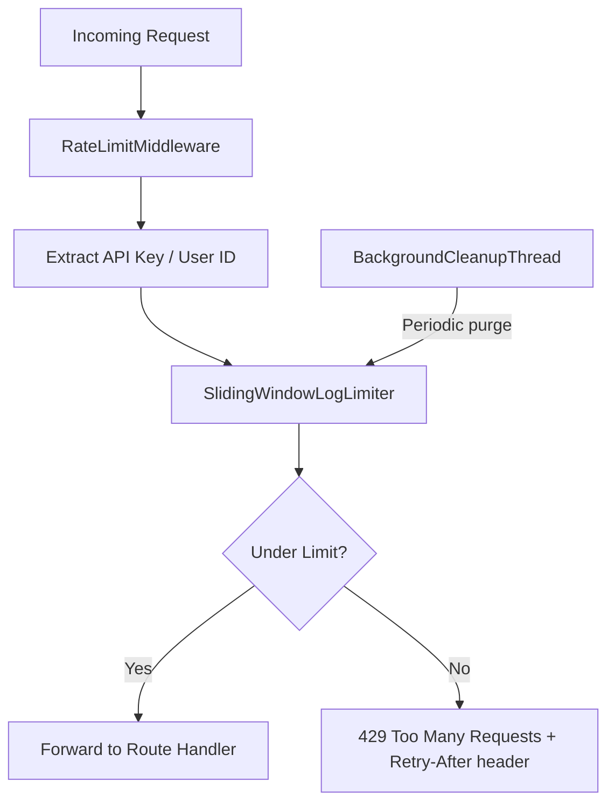

# Rate Limiter -- Sliding Window Log with FastAPI

## Algorithm

**Sliding Window Log**: For each user/API key, store a `collections.deque` of request timestamps. On each request:

1. Acquire a per-user lock
2. Purge timestamps older than `now - window_size`
3. If `len(deque) < max_requests`, append `now` and allow; otherwise reject with HTTP 429

This gives exact accuracy (no approximation) at the cost of O(N) memory per user where N = max allowed requests.

## Architecture



## Project Structure

```
be-uno/
  requirements.txt
  app/
    __init__.py
    main.py                  # FastAPI app, lifespan, mount middleware
    config.py                # Settings via pydantic-settings
    rate_limiter/
      __init__.py
      limiter.py             # SlidingWindowLogLimiter (core logic)
      middleware.py           # FastAPI middleware
      cleanup.py             # Background cleanup daemon thread
      exceptions.py          # RateLimitExceeded exception
  tests/
    __init__.py
    conftest.py              # Shared fixtures
    test_limiter.py          # Unit tests for core limiter
    test_middleware.py        # Integration tests (TestClient)
    test_concurrency.py      # Multi-threaded stress tests
```

## Key Design Decisions

### Thread Safety

- A single `threading.Lock` guards the top-level dictionary (`dict[str, deque]`) for user lookup/creation.
- Each user entry gets its own `threading.Lock` so concurrent requests from different users never contend.
- This two-level locking avoids a global bottleneck while keeping the implementation safe for FastAPI's thread pool executor.

### Background Cleanup

- A daemon `threading.Thread` runs every configurable interval (default 60s).
- It iterates over all users, acquires per-user locks, and removes timestamps older than the window.
- Users with empty deques are removed entirely (under the global lock) to reclaim memory.
- The thread is started/stopped via FastAPI's lifespan context manager.

### API Key Extraction

- The middleware will look for the API key in the following order:

  1. `X-API-Key` header
  2. `api_key` query parameter
  3. Fall back to client IP (`request.client.host`)

### HTTP 429 Response

- Body: `{"detail": "Rate limit exceeded. Try again later.", "retry_after": <seconds>}`
- Header: `Retry-After: <seconds>` (seconds until the oldest tracked request expires)
- Headers on every response: `X-RateLimit-Limit`, `X-RateLimit-Remaining`, `X-RateLimit-Reset`

### Configuration (`app/config.py`)

- `RATE_LIMIT_MAX_REQUESTS`: int (default 60)
- `RATE_LIMIT_WINDOW_SECONDS`: int (default 60)
- `CLEANUP_INTERVAL_SECONDS`: int (default 60)
- Loaded from environment variables via `pydantic-settings`.

## Dependencies (`requirements.txt`)

- `fastapi>=0.100.0`
- `uvicorn[standard]>=0.23.0`
- `pydantic-settings>=2.0.0`
- `pytest>=7.0.0`
- `httpx>=0.24.0` (for async TestClient)

## Tests

| File | What it covers |

|------|---------------|

| `test_limiter.py` | allow/deny logic, window expiry, multiple users, edge cases (0 limit, 1 limit) |

| `test_middleware.py` | Full HTTP integration via `TestClient`: 200s, 429s, correct headers, key extraction |

| `test_concurrency.py` | Spawn N threads hitting the limiter simultaneously; assert total allowed = max_requests |